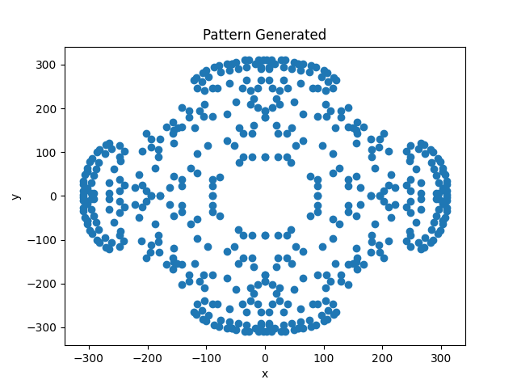

# Branching Fractal Pattern Coordinate Generator 

The folder contains: 
    1) genTree.py This file contains a function gen_tree() which will produce tree like branching patterns.  
    2) Examples of coordinate files produced by this generator 
    3) Images of the generated patterns  

To use this generator: 
    1 Adjust the parameters within genTree.py to produce the desired tree structure 

If a file called coords.csv already exists, it will be overwritten, if not, it will be created. 
