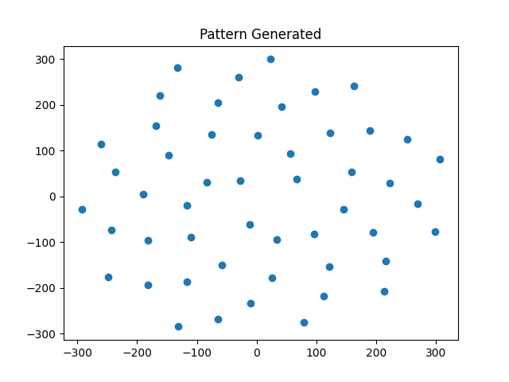

# Spiral Pattern Coordinate Generator 

The folder contains: 
    1) genSpiral.py This file contians a function gen_spiral() which will produce spiral patterns.  
    2) Examples of coordinate files produced by this generator. 
    3) Images of the generated patterns.  

To use this generator: 
    1) Adjust the parameters within genSpiral.py to produce the desired spiral.  

If a file called coords.csv already exists, it will be overwritten, if not, it will be created. 
